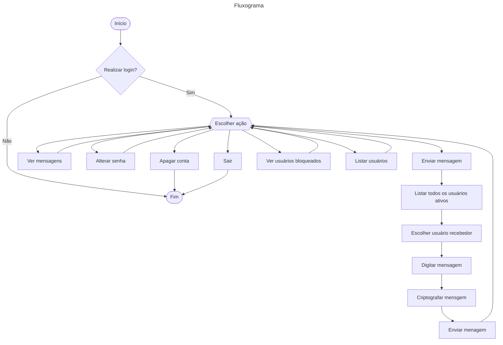

```mermaid

---
title: Fluxograma
---

flowchart TD
    Inicio(["Início"]) --> id1{Realizar login?}

    id1 --> |Sim| Ação
    id1 --> |Não| Fim(["Fim"])

    Ação{{Escolher ação}} --> id2[Enviar mensagem]
    Ação --> id3[Ver mensagens]
    Ação --> id4[Alterar senha]
    Ação --> id5[Apagar conta]
    Ação --> id6[Sair]
    Ação --> id7[Ver usuários bloqueados]
    Ação --> id8[Listar usuários]

    id2 --> id9[Listar todos os usuários ativos]
    id9 --> id10[Escolher usuário recebedor]
    id10 --> id11[Digitar mensagem]
    id11 --> id12[Criptografar mensgem]
    id12 --> id13[Enviar menagem]
    
    id13 --> Ação
    id3 --> Ação
    id4 --> Ação
    id5 --> Fim
    id6 --> Fim
    id7 --> Ação
    id8 --> Ação

    

```