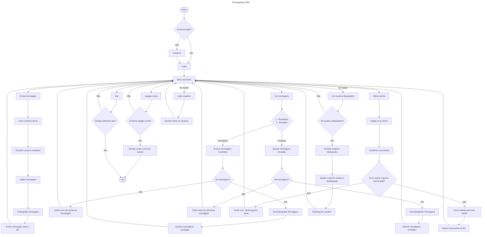

```mermaid

---
title: Fluxograma SSC
---

flowchart TD
    Start([Início]) --> choiceLogin{Já possui login?}
    choiceLogin -- Sim --> login[Login]
    choiceLogin -- Não --> register[Cadastro]
    register --> login

    login --> action[Menu de Ações]
    
    %% Ações Gerais
    action --> sendMsgOpt[Enviar mensagem]
    action --> verMsgOpt[Ver mensagens]
    action --> changePwdOpt[Alterar senha]
    action --> deleteAccOpt[Apagar conta]
    action --> exitOpt[Sair]
    
    %% Ações para Master
    action -- "Se master" --> blockedOpt[Ver usuários bloqueados]
    action -- "Se master" --> listUsersOpt[Listar usuários]
    
    %% Ramo Enviar Mensagem
    sendMsgOpt --> listActive[Listar usuários ativos]
    listActive --> chooseUser[Escolher usuário recebedor]
    chooseUser --> typeMsg[Digitar mensagem]
    typeMsg --> encryptMsg[Criptografar mensagem]
    encryptMsg --> sendMsg[Enviar mensagem para o BD]
    sendMsg --> action

    %% Ramo Ver Mensagens
    verMsgOpt --> selectMsgType{1 - Recebidas<br>2 - Enviadas}
    selectMsgType -- Recebidas --> recMsg[Buscar mensagens recebidas]
    recMsg --> recCheck{Há mensagens?}
    recCheck -- Sim --> decryptRec[Descriptografar mensagens]
    decryptRec --> showRec[Mostrar mensagens recebidas]
    showRec --> action
    recCheck -- Não --> noRec[Exibir aviso de nenhuma mensagem]
    noRec --> action
    
    selectMsgType -- Enviadas --> sentMsg[Buscar mensagens enviadas]
    sentMsg --> sentCheck{Há mensagens?}
    sentCheck -- Sim --> decryptSent[Descriptografar mensagens]
    decryptSent --> showSent[Mostrar mensagens enviadas]
    showSent --> action
    sentCheck -- Não --> noSent[Exibir aviso de nenhuma mensagem]
    noSent --> action

    %% Ramo Alterar Senha
    changePwdOpt --> newPwd[Digitar nova senha]
    newPwd --> confirmPwd[Confirmar nova senha]
    confirmPwd --> sameCheck{Nova senha é igual à senha atual?}
    sameCheck -- Sim --> pwdError[Exibir erro: Senha igual à atual]
    pwdError --> action
    sameCheck -- Não --> hashPwd[Fazer hashing da nova senha]
    hashPwd --> savePwd[Salvar nova senha no BD]
    savePwd --> action

    %% Ramo Apagar Conta
    deleteAccOpt --> delConfirm{Confirma apagar conta?}
    delConfirm -- Sim --> delAcc[Deletar conta e encerrar sessão]
    delAcc --> End([Fim])
    delConfirm -- Não --> action

    %% Ramo Sair
    exitOpt --> exitConfirm{Deseja realmente sair?}
    exitConfirm -- Sim --> End
    exitConfirm -- Não --> action

    %% Ramo Usuários Bloqueados (Master)
    blockedOpt --> checkBlocked{Há usuários bloqueados?}
    checkBlocked -- Não --> action
    checkBlocked -- Sim --> showBlocked[Mostrar usuários bloqueados]
    showBlocked --> inputBlocked[Digitar e-mail do usuário a desbloquear]
    inputBlocked --> unblock[Desbloquear usuário]
    unblock --> action

    %% Ramo Listar Usuários (Master)
    listUsersOpt --> showUsers[Mostrar todos os usuários]
    showUsers --> action


    

```