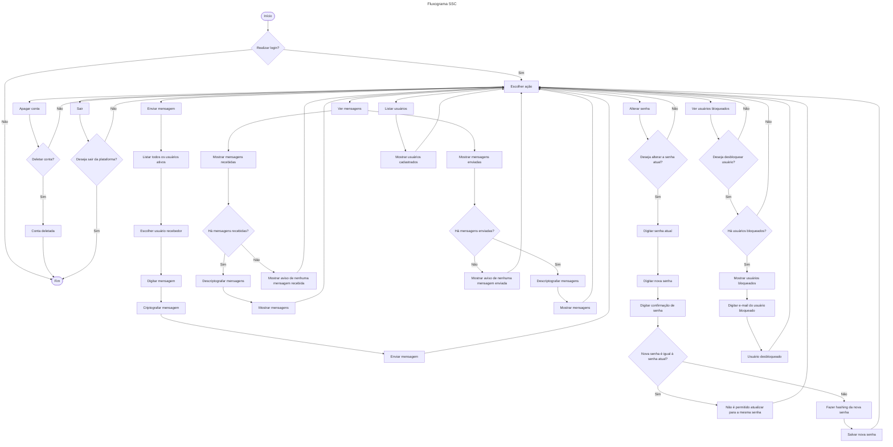

```mermaid

---
title: Fluxograma SSC
---

flowchart TD
    Start([Início]) --> login{Realizar login?}
    login -- Sim --> action[Escolher ação]
    login -- Não --> End([Fim])

    action --> msg[Enviar mensagem]
    action --> verMsg[Ver mensagens]
    action --> changePwd[Alterar senha]
    action --> deleteAcc[Apagar conta]
    action --> logout[Sair]
    action --> blocked[Ver usuários bloqueados]
    action --> listUsers[Listar usuários]

    %% Ramo Enviar Mensagem
    msg --> listActive[Listar todos os usuários ativos]
    listActive --> chooseUser[Escolher usuário recebedor]
    chooseUser --> typeMsg[Digitar mensagem]
    typeMsg --> encrypt[Criptografar mensagem]
    encrypt --> sendMsg[Enviar mensagem]
    sendMsg --> action

    %% Ramo Ver Mensagens - Recebidas
    verMsg --> rec[Mostrar mensagens recebidas]
    rec --> recCheck{Há mensagens recebidas?}
    recCheck -- Sim --> recDecrypt[Descriptografar mensagens]
    recDecrypt --> showRec[Mostrar mensagens]
    showRec --> action
    recCheck -- Não --> noRec[Mostrar aviso de nenhuma mensagem recebida]
    noRec --> action

    %% Ramo Ver Mensagens - Enviadas
    verMsg --> sent[Mostrar mensagens enviadas]
    sent --> sentCheck{Há mensagens enviadas?}
    sentCheck -- Sim --> sentDecrypt[Descriptografar mensagens]
    sentDecrypt --> showSent[Mostrar mensagens]
    showSent --> action
    sentCheck -- Não --> noSent[Mostrar aviso de nenhuma mensagem enviada]
    noSent --> action

    %% Ramo Alterar Senha
    changePwd --> pwdConfirm{Deseja alterar a senha atual?}
    pwdConfirm -- Não --> action
    pwdConfirm -- Sim --> currentPwd[Digitar senha atual]
    currentPwd --> newPwd[Digitar nova senha]
    newPwd --> confirmPwd[Digitar confirmação de senha]
    confirmPwd --> sameCheck{Nova senha é igual à senha atual?}
    sameCheck -- Sim --> error[Não é permitido atualizar para a mesma senha]
    error --> action
    sameCheck -- Não --> hash[Fazer hashing da nova senha]
    hash --> savePwd[Salvar nova senha]
    savePwd --> action

    %% Ramo Apagar Conta
    deleteAcc --> delConfirm{Deletar conta?}
    delConfirm -- Sim --> delAcc[Conta deletada]
    delAcc --> End
    delConfirm -- Não --> action

    %% Ramo Sair
    logout --> exitConfirm{Deseja sair da plataforma?}
    exitConfirm -- Sim --> End
    exitConfirm -- Não --> action

    %% Ramo Usuários Bloqueados
    blocked --> unblockConfirm{Deseja desbloquear usuário?}
    unblockConfirm -- Não --> action
    unblockConfirm -- Sim --> checkBlocked{Há usuários bloqueados?}
    checkBlocked -- Não --> action
    checkBlocked -- Sim --> showBlocked[Mostrar usuários bloqueados]
    showBlocked --> inputEmail[Digitar e-mail do usuário bloqueado]
    inputEmail --> unblocked[Usuário desbloqueado]
    unblocked --> action

    %% Ramo Listar Usuários
    listUsers --> showUsers[Mostrar usuários cadastrados]
    showUsers --> action


    

```