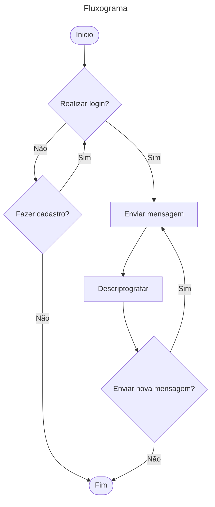

```mermaid

---
title: Fluxograma
---
flowchart TD
    Inicio(["Inicio"]) --> id1{Realizar login?}
    
    id1 -- Sim --> id2[Enviar mensagem]
    id1 -- Não --> id3{Fazer cadastro?}
    
    id3 -- Sim --> id1
    id3 -- Não --> Fim(["Fim"])
    
    id2 --> id4[Descriptografar]
    id4 --> id5{Enviar nova mensagem?}
    
    id5 -- Sim --> id2
    id5 -- Não --> Fim

```